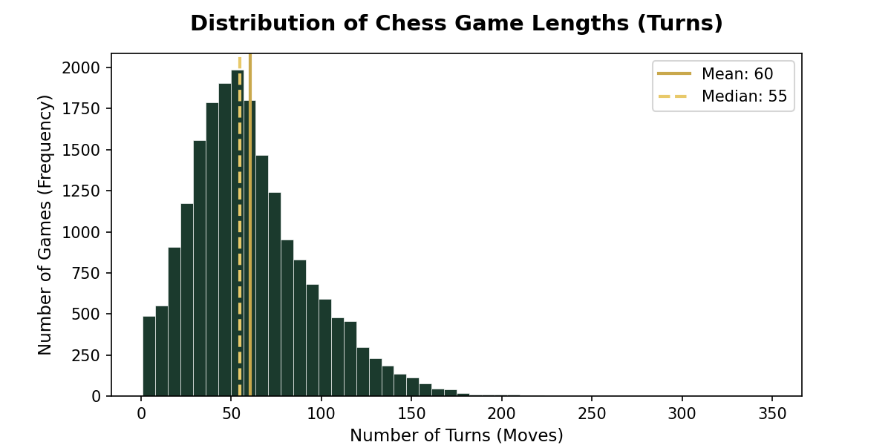
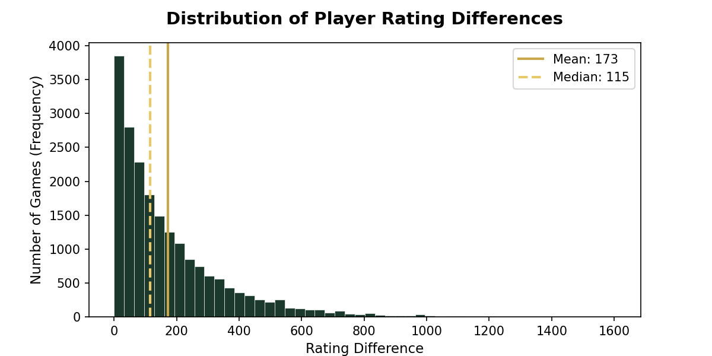

# Chess & WHO Data Analysis Project

## Executive Summary (Conclusion-First)

This project answers five analytical questions using two datasets: a Chess Games dataset and the WHO Life Expectancy dataset.

### Key Findings

1. Chess game lengths and player rating differences are both right-skewed distributions, meaning most observations are concentrated at lower values while a small number of extreme cases create long tails.
2. Neither variable follows a normal distribution. Square-root transformation produced the most symmetric distributions and improved normality more effectively than log transformation.
3. Life expectancy is most strongly associated with schooling, income composition of resources, and BMI, while adult mortality, HIV/AIDS, and adolescent thinness show the strongest negative relationships.
4. Player rating groups and game outcomes have a statistically significant relationship, but the practical effect is very weak.
5. Rated chess games have an average length between 61.4 and 62.5 moves, with both parametric and bootstrap confidence intervals producing identical results, indicating highly reliable estimates.

## Findings

### Q1. Descriptive Statistics of Chess Variables

**Turns (Game Length)**

* Mean = 60.47
* Median = 55.00
* IQR = 42.00
* Skewness = 0.90
  
Chess game lengths are moderately right-skewed, with most games ending around 55 moves while a small number of very long games increase the average to 60.47 moves.

**Rating Difference**

* Mean = 173.09
* Median = 115.00
* IQR = 196.00
* Skewness = 1.95

Player rating differences are strongly right-skewed. Most matches involve players with similar ratings, but a small number of extreme mismatches raise the average rating gap to 173.09 points.

### Q2. Distribution Analysis and Normality

Both variables fail the Shapiro-Wilk normality test, confirming that neither follows a normal distribution.
### Turns

* Shapiro-Wilk p-value = 0.000000
* Original skew = 0.90
* Log-transformed skew = -1.61
* Square-root skew = -0.06

The distribution is not normal. The square-root transformation produced an almost perfectly symmetric distribution.

**Chart:** `output/charts/Q2_turns_dist.png`

For game length (`turns`), the square-root transformation reduced skewness from 0.90 to -0.06, producing an almost perfectly symmetric distribution. The log transformation over-corrected the distribution.

### Rating Difference

* Shapiro-Wilk p-value = 0.000000
* Original skew = 1.95
* Log-transformed skew = -0.90
* Square-root skew = 0.62
  
For player rating difference (`rating_diff`), the square-root transformation reduced skewness from 1.95 to 0.62 and performed better than the log transformation, which introduced negative skewness.

**Chart:** `output/charts/Q2_rating_diff_dist.png`

<p align="center">
  
</p>

<p align="center">
  
</p>

### Q3. WHO Factors Associated with Life Expectancy

#### Strongest Positive Correlations

| Variable                        | Correlation |
| ------------------------------- | ----------- |
| Schooling                       | 0.716       |
| Income Composition of Resources | 0.694       |
| BMI                             | 0.560       |

#### Strongest Negative Correlations

| Variable               | Correlation |
| ---------------------- | ----------- |
| Adult Mortality        | -0.696      |
| HIV/AIDS               | -0.557      |
| Thinness (10–19 years) | -0.473      |

Additional findings:

* Pearson correlation (Schooling vs Life Expectancy): 0.716
* Spearman correlation: 0.780
* Partial correlation controlling for GDP: 0.651

Schooling remains strongly associated with life expectancy even after controlling for GDP, indicating that education has an independent relationship with longevity beyond national wealth.

### Q4. Rating Group and Win Rate

* Chi-Squared Statistic = 278.674
* p-value = 0.000000
* Degrees of Freedom = 4
* Cramér's V = 0.083

The Chi-squared test shows a statistically significant relationship between player rating group and game outcome (p < 0.001).

However, Cramér's V is only 0.083, indicating that the practical effect is negligible. While rating groups influence win rates mathematically, their real-world predictive value is very weak.

### Q5. Confidence Interval for Rated Game Length

#### Parametric 95% Confidence Interval

* (61.4, 62.5)

#### Bootstrap 95% Confidence Interval

* (61.4, 62.5)

Both methods produced identical intervals, indicating a highly stable and reliable estimate of the average number of moves in rated chess games.

---

## How to Run

Run the project from:

```bash
python main.py
```

---

## Datasets

### Chess Games Dataset

* Raw Dataset:

  * URL: https://www.kaggle.com/datasets/datasnaek/chess
  * Path: `data/raw/games.csv`

* Preprocessed Dataset:

  * Path: `data/processed/chess_clean.csv`

### WHO Life Expectancy Dataset

* Raw Dataset:

  * URL: https://www.kaggle.com/datasets/kumarajarshi/life-expectancy-who
  * Path: `data/raw/who_life_expectancy.csv`

* Preprocessed Dataset:

  * Path: `data/processed/who_clean.csv`    

---

## Data Cleaning

Only minimal preprocessing was applied:

* Removed missing or invalid records.
* Standardized column names and data types.
* Created derived variables when required (e.g., `rating_diff`).
* Prepared datasets for statistical analysis and visualization.

---